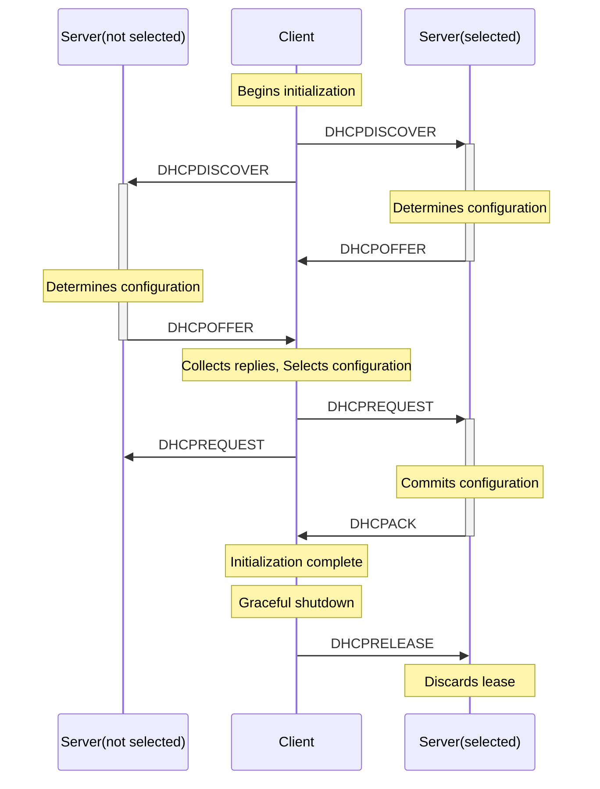

## 协议说明

DHCP 协议（动态主机设定协定）是一个用于局域网的网络协议，位于TCP/IP的应用层，使用UDP协议工作，主要有两个用途：

- 用于内部网络和网络服务商自动分配IP给用户
- 用于内部网络管理员对所有电脑作中央管理

DHCP 用一台或一组DHCP服务器来管理网络参数的分配，这种分配方式具有容错性。即使在一个仅拥有少量机器的网络中，DHCP仍然是有用的，因为一台机器可以不造成任何影响的被加入到网路中。

甚至对于很少改变地址的服务器，DHCP仍然被建议用来设置它们的地址。如果服务器需要被重新分配地址，尽可能不改变之前的配置。对于一些设备，如路由器和防火墙，则不应该使用DHCP。

DHCP 于 1993 年10月成为标准协议，前身是 BOOTP （Bootstrap Protocol， 引导程序协议），DHCP 被设计成向前兼容 BOOTP 协议。当前的DHCP定义可以在[RFC 2131](https://tools.ietf.org/html/rfc2131)找到，而基于IPv6的建议标准(DHCPv6)可以在[RFC3315](https://tools.ietf.org/html/rfc3315)中找到。

<!--more-->

## 协议结构


- Op：消息操作代码，既可以是引导请求（BOOTREQUEST 1）也可以是引导答复（BOOTREPLY 2）
- Htype：硬件地址类型
- Hlen：硬件地址长度
- Hops：客户端设置为0，relay agent使用
- Xid：处理ID
- Secs：从获取到IP地址或者续约过程开始到现在所消耗的时间
- Flags：标记
- Ciaddr：客户机IP地址
- Yiaddr：“你的”（客户机）IP地址
- Siaddr：在bootstrap中使用的下一台服务器的IP地址
- Giaddr：用于导入的接替代理IP地址
- Chaddr：客户机硬件
- Sname：任意服务器主机名称，空终止符
- File：DHCP发现协议中的引导文件名、空终止符、属名或者空，DHCP供应协议中的受限目录路径名
- Options：可选参数字段。参考定义选择列表中的选择文件

## 协议时序



DHCP 客户端发送 DHCPDISCOVER 广播报文请求 DHCP 网络配置；

Server 端收到后应答 DHCPOFFER 配置客户端；客户端选择一个 Server 以及它提供的网络参数，填写 `server identifier` option 后广播 DHCPREQUEST 报文；

Server 接收到 DHCPREQUEST 报文，没被选中的 Sever 通过该报文确认 client 没有使用自己提供的配置，被选中的 Server 持久化客户端binding配置，并应答 DHCPACK 报文，DHCPACK 中的配置不能和之前的 DHCPOFFER 冲突，并且 Server 在该阶段并不检查提供的网络地址；

客户端接收到 DHCPACK 后，应该对参数作最后的检查（例如ARP检查获得的网络地址），并记录lease时间。如果客户端发现网络地址已经被占用了，客户端需要发送 DHCPDECLINE 消息给 Server 并等待至少10s后重启配置流程。

## DHCP 协议状态转移图


## DHCP 常用 Option 字段

### Subnet Mask

客户端子网掩码，如果subnet mask option和router option同时指定，subnet mask必须第一个。

```txt
Code   Len        Subnet Mask
+-----+-----+-----+-----+-----+-----+
|  1  |  4  |  m1 |  m2 |  m3 |  m4 |
+-----+-----+-----+-----+-----+-----+
```

### Router Option

指定客户端子网中的路由器IP列表。

```txt
Code   Len         Address 1               Address 2
+-----+-----+-----+-----+-----+-----+-----+-----+--
|  3  |  n  |  a1 |  a2 |  a3 |  a4 |  a1 |  a2 |  ...
+-----+-----+-----+-----+-----+-----+-----+-----+--
```

### Domain Name Server Option

为客户端指定DNS列表。

```txt
Code   Len         Address 1               Address 2
+-----+-----+-----+-----+-----+-----+-----+-----+--
|  6  |  n  |  a1 |  a2 |  a3 |  a4 |  a1 |  a2 |  ...
+-----+-----+-----+-----+-----+-----+-----+-----+--
```

### Host Name Option

指定客户端名字。

```txt
Code   Len                 Host Name
+-----+-----+-----+-----+-----+-----+-----+-----+--
|  12 |  n  |  h1 |  h2 |  h3 |  h4 |  h5 |  h6 |  ...
+-----+-----+-----+-----+-----+-----+-----+-----+--
```

### Domain Name

指定客户端hostname的在DNS中记录的域名。

```txt
Code   Len        Domain Name
+-----+-----+-----+-----+-----+-----+--
|  15 |  n  |  d1 |  d2 |  d3 |  d4 |  ...
+-----+-----+-----+-----+-----+-----+--
```

### Interface MTU Option

网卡MTU。

```txt
Code   Len      MTU
+-----+-----+-----+-----+
|  26 |  2  |  m1 |  m2 |
+-----+-----+-----+-----+
```

### Static Route Option

指定客户端需要添加的静态路由。default route(0.0.0.0) 在静态路由中使用是非法的。

```txt
Code   Len         Destination 1           Router 1
+-----+-----+-----+-----+-----+-----+-----+-----+-----+-----+
|  33 |  n  |  d1 |  d2 |  d3 |  d4 |  r1 |  r2 |  r3 |  r4 |
+-----+-----+-----+-----+-----+-----+-----+-----+-----+-----+
        Destination 2           Router 2
+-----+-----+-----+-----+-----+-----+-----+-----+---
|  d1 |  d2 |  d3 |  d4 |  r1 |  r2 |  r3 |  r4 | ...
+-----+-----+-----+-----+-----+-----+-----+-----+---
```

### Classless Route Option

支持CIDR目的路由，如果客户端不支持，忽略该配置；如果客户端支持，当static route 和 classless route 同时配置时，忽略static route option。如果Server同时返回 classless route和router option，忽略router option。

很多客户端可能不支持该选项，Server 最好同时发送 classless route和router option，在 classless route和router option中同时指定默认网关。

当客户端请求classless route，同时请求static routes或routers option时，Server只需要发送classless route，不要发送static routes和routers option。

```txt
Code Len Destination 1    Router 1
+-----+---+----+-----+----+----+----+----+----+
| 121 | n | d1 | ... | dN | r1 | r2 | r3 | r4 |
+-----+---+----+-----+----+----+----+----+----+

Destination 2       Router 2
+----+-----+----+----+----+----+----+
| d1 | ... | dN | r1 | r2 | r3 | r4 |
+----+-----+----+----+----+----+----+
```

### Server Identifier

DHCPOFFER 和 DHCPREQUEST 中用于指定 DHCP Server。

```txt
Code   Len            Address
+-----+-----+-----+-----+-----+-----+
|  54 |  4  |  a1 |  a2 |  a3 |  a4 |
+-----+-----+-----+-----+-----+-----+
```

### Client-identifier

客户端默认用硬件地址来作为ID，但是也可以用这个值作为ID，Server 可以使用这个id来存取客户端的配置。服务器可以用域名，虚拟机用机器UUID来设置该值。

```txt
Code   Len   Type  Client-Identifier
+-----+-----+-----+-----+-----+---
|  61 |  n  |  t1 |  i1 |  i2 | ...
+-----+-----+-----+-----+-----+---
```
## 参考资料

- [DHCP WIKI](https://www.wikiwand.com/zh-hans/%E5%8A%A8%E6%80%81%E4%B8%BB%E6%9C%BA%E8%AE%BE%E7%BD%AE%E5%8D%8F%E8%AE%AE)
- [**RFC2131** Dynamic Host Configuration Protocol](https://tools.ietf.org/html/rfc2131)
- [**RFC3315** Dynamic Host Configuration Protocol for IPv6 (DHCPv6)](https://tools.ietf.org/html/rfc3315)
- [**RFC951** BOOTSTRAP PROTOCOL (BOOTP)](https://tools.ietf.org/html/rfc951)
- [**RFC1542** Clarifications and Extensions for the Bootstrap Protocol](https://tools.ietf.org/html/rfc1542)
- [**RFC1533** DHCP Options and BOOTP Vendor Extensions](https://tools.ietf.org/html/rfc1533)
- [**RFC3442** The Classless Static Route Option for Dynamic Host Configuration Protocol (DHCP) version 4](https://tools.ietf.org/html/rfc3442)

## 附录

状态图源码

```txt
stateDiagram
    [*] --> INIT
    INIT --> SELECTING: -/Send DHCPDISCOVER
    SELECTING --> SELECTING: DHCPOFFER/Collect replies
    SELECTING --> REQUESTING: Select offerk/send DHCPREQUEST
    REQUESTING --> REQUESTING: DHCPOFFER/Discard
    REQUESTING --> INIT: DHCPNAK/Discard offer, DHCPACK (not accept.)/Send DHCPDECLINE
    REQUESTING --> BOUND: DHCPACK/Record lease, set timers T1, T2
    BOUND --> BOUND: DHCPOFFER, DHCPACK, DHCPNAK/Discard
    BOUND --> RENEWING: T1 expires/Send DHCPREQUEST to leasing server
    RENEWING --> BOUND: DHCPACK/Record lease, set timers T1, T2
    RENEWING --> REBINDING: T2 expires/Broadcast DHCPREQUEST
    RENEWING --> INIT: DHCPNAK/Halt network
    REBINDING --> BOUND: DHCPACK/Record lease, set timers T1,T2
    REBINDING --> INIT: DHCPNAK, Lease expired/Halt network
    INIT_REBOOT --> REBOOTING: -/Send DHCPREQUEST
    REBOOTING --> BOUND: DHCPACK/Record lease, set timers T1, T2
    REBOOTING --> INIT: DHCPNAK/Restart
```